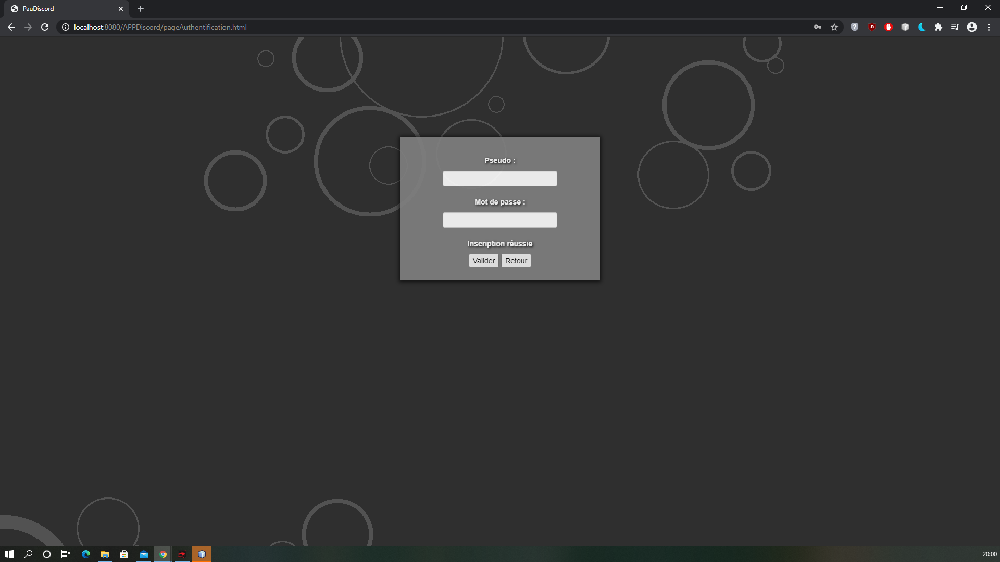
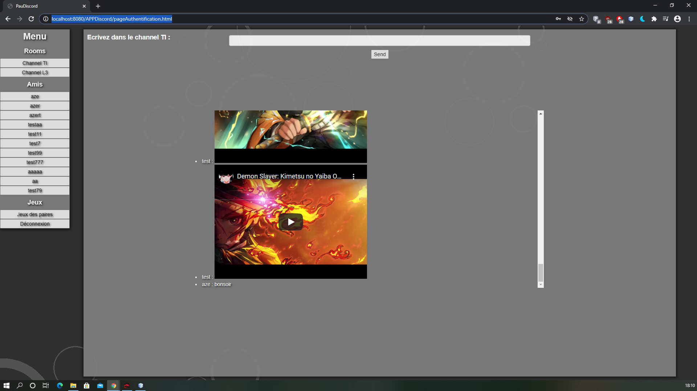

# projet_discord

## Context du projet

Faire une application web qui devait reprendre les fonctionnalités fondamentales de "Discord" (création de groupes de discussion / pouvoir converser avec une personne directement). La partie serveur doit être développée en JAVA et la partie client en HTML, JS, CSS.
Les technos qu'on doit absolument utiliser :
* Hibernate
* Entity Beans

Les communications entre le serveur et le client peuvent se faire :
* soit avec :
  - Servlet
  - Ajax

* ou bien avec :
  - WebSocket
  
 ## Technos utilisées :

 * JDBC
 * Hibernate
 * Entity Beans
 * WebSocket
 * Ajax
 * API Rest
 * Servlet
 * Bootstrap
 * jQuery
 * IDE : NetBeans 8.2
 * Langages de programmation utilisés : JAVA 8, HTML5, CSS3, JS
 
 ## Comment installer et utiliser l'application ?
 
 * installer l'IDE Netbeans et Java 8
 * ouvrir le projet sur NetBeans
 * démarrer votre serveur de base de données
 * lancer le script Java "createDBAndTables" qui se trouve à cet endroit "projet_discord/APPDiscord/src/java/createDB/". Il va créer la base de données et l'alimenter avec des      comptes utilisateurs de test
 * installer dans l'IDE un serveur "GlassFish" et démarrer le
 * dans le dossier web ("projet_discord/APPDiscord/web/") vous avez un fichier "configuration.js", vous devrez renseigner l'adresse de votre serveur "GlassFish"
 * lancer le fichier "pageAuthentification.html" ("projet_discord/APPDiscord/web/")

 ## Des screenshots de l'application :
 ### Page d'authentification :
 
 
### Page d'inscription :
 
 
 * lorsqu'un champ n'a pas été rempli lors de l'inscription :
 
 
 * pseudo déjà utilisé :
 
 
 * inscription réussie :
 
 
### Page d'accueil sur laquelle on tombe après s'être connecté : 

### Page qui permet à une personne de parler à d'autres personnes :

### Page qui permet à une personne de jouer au jeu des paires :

### Notification qui apparait lorsque vous recevez un message :

## Remarques :
Cette application sera refaite avec Angular pour le front et Vert.x pour le back. Aussi, le code n'a pas été refactorisé depuis 2017 (du code en mauvais état pour l'instant). Donc, cette version de l'application va changer dans les jours, mois à venir. 
